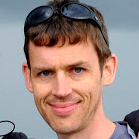

# 原文作者

## Alan A. A. Donovan

**Alan A. A. Donovan** is a member of Google’s Go team in New York. He holds computer science degrees from Cambridge and MIT and has been programming in industry since 1996. Since 2005, he has worked at Google on infrastructure projects and was the co-designer of its proprietary build system, Blaze. He has built many libraries and tools for static analysis of Go programs, including oracle, godoc -analysis, eg, and gorename.

## Brian W. Kernighan

**Brian W. Kernighan** is a professor in the Computer Science Department at Princeton University. He was a member of technical staff in the Computing Science Research Center at Bell Labs from 1969 until 2000, where he worked on languages and tools for Unix. He is the co-author of several books, including The C Programming Language, Second Edition (Prentice Hall, 1988), and The Practice of Programming (Addison-Wesley, 1999).

-------

# 中文譯者

中文譯者                               | 章節
-------------------------------------- | -------------------------
`chai2010     <chaishushan@gmail.com>` | 前言/第二章/第三章/第四章/第十章/第十一章/第十二章/第十三章
`CrazySssst`                           | 第三章(0節)
`foreversmart <njutree@gmail.com>`     | 第七章(0節/1節/2節)
`Xargin       <cao1988228@163.com>`    | 第一章/第六章/第八章

# 譯文授權

除特别註明外, 本站內容均采用[知識共享-署名(CC-BY) 3.0協議](http://creativecommons.org/licenses/by/3.0/)授權, 代碼遵循[Go項目的BSD協議](http://golang.org/LICENSE)授權.

<a rel="license" href="http://creativecommons.org/licenses/by-nc-sa/4.0/"></img></a>

