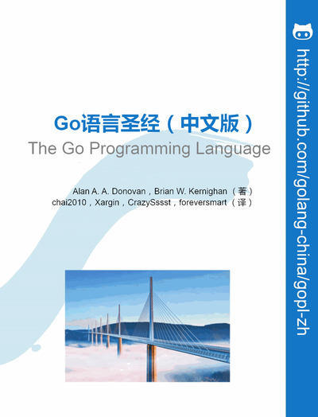

# Go語言聖經（中文版）

Go語言聖經 [《The Go Programming Language》](http://gopl.io) 中文版本，僅供學習交流之用。

- 在線版本：http://golang-china.github.io/gopl-zh
- 離線版本：http://github.com/golang-china/gopl-zh/archive/gh-pages.zip
- 項目主頁：http://github.com/golang-china/gopl-zh
- 原版官網：http://gopl.io

### 從源文件構建

先安裝NodeJS和GitBook命令行工具(`npm install gitbook-cli -g`命令)。

1. 下載 https://github.com/golang-china/gopl-zh/archive/master.zip ，獲取源文件。
2. 切換到 `gopl-zh` 目録，運行 `gitbook install`，安裝GitBook插件。
3. 運行`gitbook build`，生成`_book`目録。
4. 打開`_book/index.html`文件。

### 簡體/繁體轉換

切片到 `gopl-zh` 目録：

- `make zh2tw` 或 `go run zh2tw.go . "\.md$" zh2tw`，轉繁體。
- `make tw2zh` 或 `go run zh2tw.go . "\.md$" tw2zh`，轉簡體。

# 版權聲明

<a rel="license" href="http://creativecommons.org/licenses/by-nc-sa/4.0/">Creative Commons Attribution-NonCommercial-ShareAlike 4.0 International License</a>。

<a rel="license" href="http://creativecommons.org/licenses/by-nc-sa/4.0/"></img></a>

嚴禁任何商業行爲使用或引用該文檔的全部或部分內容！

歡迎大家提供建議！
