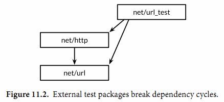

### 11.2.4. 外部测试包

考虑下这两个包：net/url包，提供了URL解析的功能；net/http包，提供了web服务和HTTP客户端的功能。如我们所料，上层的net/http包依赖下层的net/url包。然后，net/url包中的一个测试是演示不同URL和HTTP客户端的交互行为。也就是说，一个下层包的测试代码导入了上层的包。


这样的行为在net/url包的测试代码中会导致包的循环依赖，正如图11.1中向上箭头所示，同时正如我们在10.1节所讲的，Go语言规范是禁止包的循环依赖的。

不过我们可以通过外部测试包的方式解决循环依赖的问题，也就是在net/url包所在的目录声明一个独立的url_test测试包。其中包名的`_test`后缀告诉go test工具它应该建立一个额外的包来运行测试。我们将这个外部测试包的导入路径视作是net/url_test会更容易理解，但实际上它并不能被其他任何包导入。

因为外部测试包是一个独立的包，所以能够导入那些`依赖待测代码本身`的其他辅助包；包内的测试代码就无法做到这点。在设计层面，外部测试包是在所有它依赖的包的上层，正如图11.2所示。



通过避免循环的导入依赖，外部测试包可以更灵活地编写测试，特别是集成测试（需要测试多个组件之间的交互），可以像普通应用程序那样自由地导入其他包。

我们可以用go list命令查看包对应目录中哪些Go源文件是产品代码，哪些是包内测试，还有哪些是外部测试包。我们以fmt包作为一个例子：GoFiles表示产品代码对应的Go源文件列表；也就是go build命令要编译的部分。



```
$ go list -f={{.GoFiles}} fmt
[doc.go format.go print.go scan.go]
```



TestGoFiles表示的是fmt包内部测试代码，以_test.go为后缀文件名，不过只在测试时被构建：



```
$ go list -f={{.TestGoFiles}} fmt
[export_test.go]
```



包的测试代码通常都在这些文件中，不过fmt包并非如此；稍后我们再解释export_test.go文件的作用。

XTestGoFiles表示的是属于外部测试包的测试代码，也就是fmt_test包，因此它们必须先导入fmt包。同样，这些文件也只是在测试时被构建运行：



```
$ go list -f={{.XTestGoFiles}} fmt
[fmt_test.go scan_test.go stringer_test.go]
```



有时候外部测试包也需要访问被测试包内部的代码，例如在一个为了避免循环导入而被独立到外部测试包的白盒测试。在这种情况下，我们可以通过一些技巧解决：我们在包内的一个_test.go文件中导出一个内部的实现给外部测试包。因为这些代码只有在测试时才需要，因此一般会放在export_test.go文件中。

例如，fmt包的fmt.Scanf函数需要unicode.IsSpace函数提供的功能。但是为了避免太多的依赖，fmt包并没有导入包含巨大表格数据的unicode包；相反fmt包有一个叫isSpace内部的简易实现。

为了确保fmt.isSpace和unicode.IsSpace函数的行为保持一致，fmt包谨慎地包含了一个测试。是一个在外部测试包内的白盒测试，是无法直接访问到isSpace内部函数的，因此fmt通过一个后门导出了isSpace函数。export_test.go文件就是专门用于外部测试包的后门。

```Go
package fmt

var IsSpace = isSpace
```

这个测试文件并没有定义测试代码；它只是通过fmt.IsSpace简单导出了内部的isSpace函数，提供给外部测试包使用。这个技巧可以广泛用于位于外部测试包的白盒测试。

