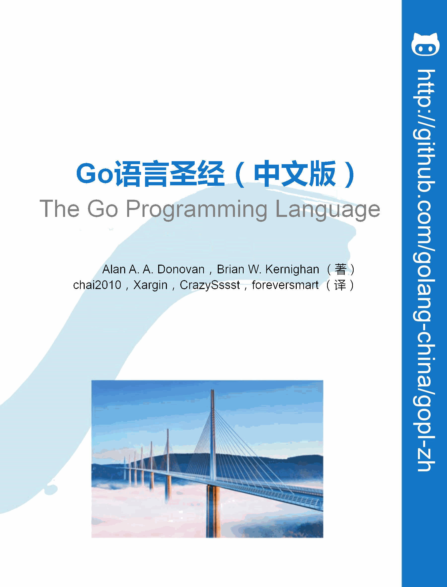

# Go语言圣经（中文版）

Go语言圣经 [《The Go Programming Language》](http://gopl.io) 中文版本，仅供学习交流之用。对于希望学习CGO、Go汇编语言等高级用法的同学，我们推荐[《Go语言高级编程》](https://github.com/chai2010/advanced-go-programming-book)开源图书。如果希望深入学习Go语言语法树结构，可以参考[《Go语法树入门——开启自制编程语言和编译器之旅》](https://github.com/chai2010/go-ast-book)。如果想从头实现一个玩具Go语言可以参考[《从头实现µGo语言》](https://github.com/wa-lang/ugo-compiler-book)（µGo 是 [凹语言](https://wa-lang.org/) 阶段的产物）。

- 在线阅读：[https://gopl-zh.github.io](https://gopl-zh.github.io)
- 在线阅读：[https://golang-china.github.io/gopl-zh](https://golang-china.github.io/gopl-zh)
- 项目主页：[https://github.com/gopl-zh](https://github.com/gopl-zh)
- 项目主页(旧)：[http://github.com/golang-china/gopl-zh](http://github.com/golang-china/gopl-zh)
- 原版官网：[http://gopl.io](http://gopl.io)

译者信息：

- 译者：柴树杉，Github [@chai2010](https://github.com/chai2010)，Twitter [@chaishushan](https://twitter.com/chaishushan)
- 译者：Xargin, [https://github.com/cch123](https://github.com/cch123)
- 译者：CrazySssst, [https://github.com/CrazySssst](https://github.com/CrazySssst)
- 译者：foreversmart, [https://github.com/foreversmart](https://github.com/foreversmart) <njutree@gmail.com>

Go 语言中国：

- Go 语言中国：[https://github.com/golang-china](https://github.com/golang-china)
- Go 语言中国论坛：[https://github.com/golang-china/main.go/discussions](https://github.com/golang-china/main.go/discussions)

