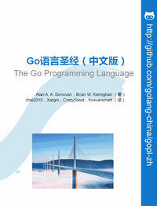

# Go語言聖經（中文版）

Go語言聖經 [《The Go Programming Language》](http://gopl.io) 中文版本，僅供編程和英語學習交流之用，請在下載後24小時內刪除。

- 項目主頁：http://github.com/golang-china/gopl-zh
- 項目進度：http://github.com/golang-china/gopl-zh/blob/master/progress.md
- 參與人員：http://github.com/golang-china/gopl-zh/blob/master/CONTRIBUTORS.md
- 在線預覽：http://golang-china.github.io/gopl-zh
- 原版官網：http://gopl.io

**版權聲明：** <a rel="license" href="http://creativecommons.org/licenses/by-nc-sa/4.0/">Creative Commons Attribution-NonCommercial-ShareAlike 4.0 International License</a>。

<a rel="license" href="http://creativecommons.org/licenses/by-nc-sa/4.0/"></img></a>

嚴禁任何商業行爲使用或引用該文檔的全部或部分內容!

歡迎大家提供建議!

# 前言

*“Go是一個開源的編程語言，它很容易用於構建簡單、可靠和高效的軟件。”（摘自Go語言官方網站：http://golang.org ）*

Go語言由來自Google公司的Robert Griesemer，Rob Pike和Ken Thompson三位大牛於2007年9月開始設計和實現，然後於2009年的11月對外正式發布（譯註：關於Go語言的創世紀過程請參考 http://talks.golang.org/2015/how-go-was-made.slide ）。語言及其配套工具的設計目標是具有表達力，高效的編譯和執行效率，有效地編寫高效和健壯的程序。

Go語言有着和C語言類似的語法外表，和C語言一樣是專業程序員的必備工具，可以用最小的代價穫得最大的戰果。
但是它不僅僅是一個更新的C語言。它還從其他語言借鑒了很多好的想法，同時避免引入過度的複雜性。
Go語言中和併發編程相關的特性是全新的也是有效的，同時對數據抽象和面向對象編程的支持也很靈活。
Go語言同時還集成了自動垃圾收集技術用於更好地管理內存。

Go語言尤其適合編寫網絡服務相關基礎設施，同時也適合開發一些工具軟件和繫統軟件。
但是Go語言確實是一個通用的編程語言，它也可以用在圖形圖像驅動編程、移動應用程序開發
和機器學習等諸多領域。目前Go語言已經成爲受歡迎的作爲無類型的腳本語言的替代者：
因爲Go編寫的程序通常比腳本語言運行的更快也更安全，而且很少會發生意外的類型錯誤。

Go語言還是一個開源的項目，可以免費穫編譯器、庫、配套工具的源代碼。
Go語言的貢獻者來自一個活躍的全球社區。Go語言可以運行在類UNIX繫統——
比如Linux、FreeBSD、OpenBSD、Mac OSX——和Plan9繫統和Microsoft Windows操作繫統之上。
Go語言編寫的程序無需脩改就可以運行在上面這些環境。

本書是爲了幫助你開始以有效的方式使用Go語言，充分利用語言本身的特性和自帶的標準庫去編寫清晰地道的Go程序。

